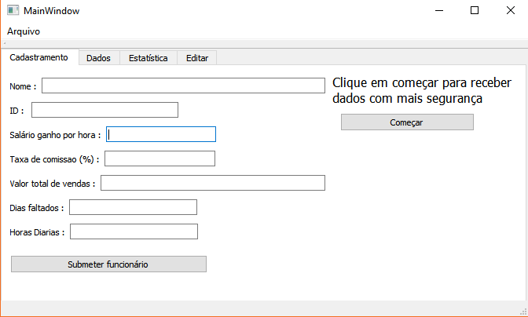
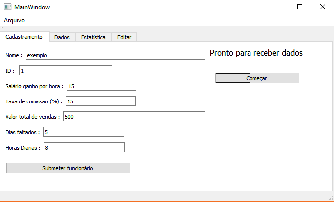
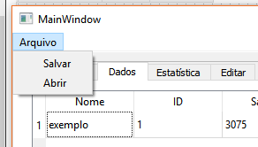
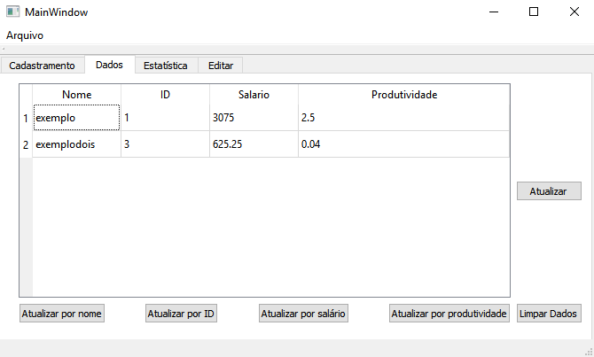
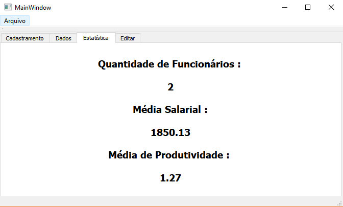
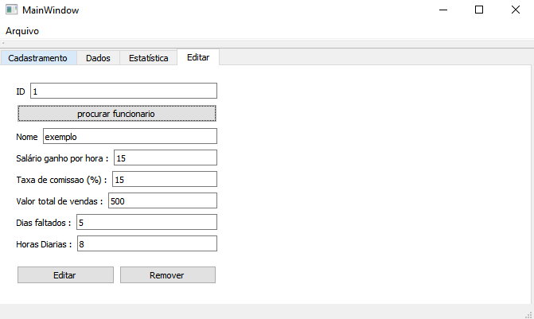

# Gerenciamento de funcionários

## 1.0 Introdução
Este programa irá fazer o gerenciamento de funcionários de uma loja/empresa, pegando entradas, conforme a figura mostra, e saindo com as saidas salário e produtividade.
## 2.0 Começando
Primeiro de tudo é preciso clicar no botão "começar" para evitar eventuais bugs, após isso é hora de digitar as entradas do funcionário, todas as entradas poderão ser editadas no futuro, com excessão do ID que será utilizado como parâmetro para corrigir as outras entradas, portanto é preciso tomar cuidado na hora de digita-lo, embora será possivel apagar algum funcionário cadastrado.

#### OBS :
#### Quantos as entradas somente o nome receberá caracteres, enquanto o resto receberá números.
#### A taxa de comissão deve ser digitada em %
## 3.0 Salvar e abrir arquivos
Neste programa é possivel salvar os dados do funcionário ou abri-los em arquivos separados por virgulas, arquivos cvc, clicando no menu "Arquivo".

## 4.0 Na aba de dados
Nesta aba é onde irão ficar listados os funcionários digitados pela entrada, ou abertos por arquivos cvc, também sera possível ordenar os funcionários por nome, id, salario, e produtividade, nesta aba também existe o botão "Limpar Dados" que apaga todos os funcionários já registrados, e não será possível pegar de volta, portanto é preciso ter cuidado.
#### O salario e produtividade são calculados da seguinte forma : 
#### salario = (horas diarias * (30 - dias faltados) * salario por hora) + vendas totais * taxa de comissão/100
#### produtividade( quantidade de vendas por hora) = vendas totais/(horas diarias * (30 - dias faltados)

## 5.0 Na aba de estatísticas
Nesta aba irá ficar as estatisticas da tabela, quantidade de funcionários registados, média salarial e média da produtividade.

## 6.0 Na aba de edição
Nesta aba será possível editar o funcionário e remover algum funcionário especifico, aqui será utilizado o id como parametro, portanto será necessário que este esteja correto, é recomendável que se clique em "procurar funcionário" antes de apertar qualquer um dos dois botões, pois este irá mostrar se o id digitado existe, e se existe as informações referentes a este id.
#### o botão de editar irá efeitivar as informações alteradas nos caches de texto abaixo de "procurar funcionário"
#### o botão de remover irá remover o funcionário guardado no id digitado

